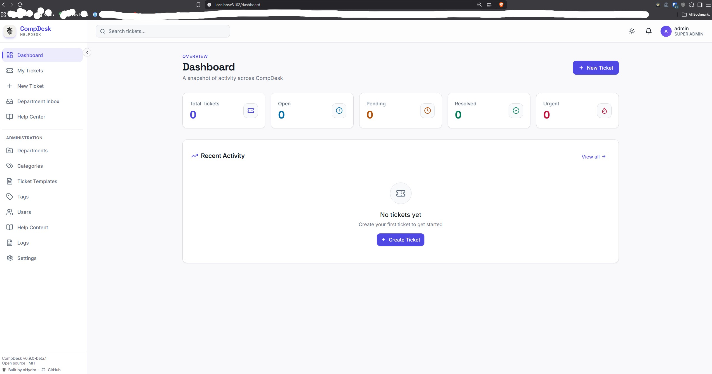
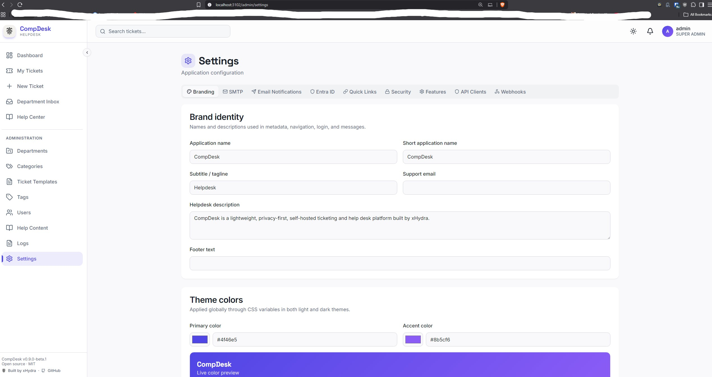

<p align="left">
  <picture>
    <source media="(prefers-color-scheme: dark)" srcset="public/brand/xhydra-mark-white.png">
    
  </picture>
</p>

# CompDesk

**Lightweight, privacy-first, self-hosted help desk and ticketing.**
Built by [xHydra](https://xhydra.fr).

[](LICENSE)
[](https://github.com/TahaHydra/CompDesk/actions/workflows/ci.yml)
[](https://github.com/TahaHydra/CompDesk/actions/workflows/security.yml)
[](docs/PUBLIC_RELEASE_CHECKLIST.md)

[xhydra.fr](https://xhydra.fr) · [github.com/TahaHydra](https://github.com/TahaHydra) · [github.com/TahaHydra/CompDesk](https://github.com/TahaHydra/CompDesk)

> **Public beta.** CompDesk is under active development and is not yet claimed as mature, production-hardened software. See [Known limitations](#known-limitations) and the [public release checklist](docs/PUBLIC_RELEASE_CHECKLIST.md) before deploying it for real users.

CompDesk is a self-hosted helpdesk for small organizations: department-scoped ticket routing, role-based access, attachments, search and filtering, and fully customizable organization branding — deployed with Docker in minutes, with no mandatory cloud account. Review the [production hardening guide](docs/PRODUCTION_HARDENING.md) before deployment.

## What it provides

- Department-scoped ticket routing, searchable queues, templates, custom fields, SLA policies, escalation, tags, comments, internal notes, and immutable timeline history.
- Four server-enforced roles: User, Agent, department Admin, and Super Admin.
- Local credentials and optional Microsoft Entra ID authentication.
- Runtime branding, SMTP notifications, signed webhooks, and department-scoped external API clients.
- Private ticket attachments with signature validation, quarantine state, quotas, audited removal, and optional ClamAV scanning.
- Optimistic ticket concurrency, PostgreSQL-backed throttling, session revocation after security changes, and normalized email identities.
- English and French interface and Help Center content.

## Supported deployment

- Ubuntu 22.04 or 24.04 and modern Debian-based Linux distributions.
- Windows 10, Windows 11, Windows Server, and macOS for standalone development or deployment.
- Docker Compose (bundled PostgreSQL) or standalone Node.js are the validated deployment paths for this beta.
- PostgreSQL 16.x is the supported and CI-tested production database for this release; other database engines and PostgreSQL major versions are not claimed as tested.
- Node.js 24 LTS is recommended; Node.js 22.12 or newer is supported.

`docker-compose.external-db.yml` (an application container connecting to an external PostgreSQL server) exists in the repository but is **not currently validated** — a live-deployment test found its `app` container never reaches the database because the orchestrator's default database host (`db`) doesn't match an externally hosted PostgreSQL server. Do not use this topology until that is fixed; track it as a known issue rather than a supported beta feature.

CompDesk must be served over HTTPS outside localhost. The production Compose topology keeps PostgreSQL private, runs migrations as a one-shot service, uses persistent volumes, and runs the application as a non-root user.

## First run

A fresh installation starts an isolated setup service before the main application. It generates a time-limited one-time token, binds to localhost by default, tests the selected PostgreSQL deployment, writes secrets atomically, runs migrations, creates the first Super Admin, and permanently disables setup after installation.

Docker Compose is the recommended deployment — one command, no Node.js or npm required:

```bash
docker compose up -d
```

Open `http://localhost:3000/setup`, complete the wizard, and the same container automatically switches itself to production on the same port. Follow [First-run setup](docs/FIRST_RUN_SETUP.md) and [Docker deployment](docs/DEPLOY_DOCKER.md) rather than adding database credentials or a fixed administrator password to source control. Demo data is optional, disabled by default, and uses generated credentials shown once.

For local development, follow [SETUP.md](SETUP.md).

## Screenshots

| Dashboard | Branding & settings |
| --- | --- |
|  |  |

More screenshots of the first-run setup wizard are in [First-run setup](docs/FIRST_RUN_SETUP.md).

## Architecture

```text
Browser
   │ HTTPS
Reverse proxy (Nginx or Caddy)
   │ forwarded origin and client address
Next.js application
   ├── PostgreSQL (tickets, policy, audit, outboxes, presence)
   ├── private attachment storage ── optional ClamAV
   ├── SMTP relay
   ├── Microsoft Entra ID OIDC
   └── signed webhook delivery
```

Normal application startup requires a completed installation and a migrated database. Readiness additionally checks database connectivity, migration state, and writable private storage. Migrations are not run concurrently by application replicas.

## Roles

| Capability | User | Agent | Department Admin | Super Admin |
| --- | --- | --- | --- | --- |
| View tickets | Own requested tickets | Assigned departments | Administered or assigned departments | Global |
| Public comments | Own tickets | Accessible tickets | Accessible tickets | All tickets |
| Internal notes and assignment | No | Accessible departments | Accessible departments | All departments |
| Configure departments | No | No | Administered departments | All departments |
| Global settings, users, API clients, audit logs | No | No | No | Yes |

The server remains the authorization boundary. See the tested [permission matrix](docs/PERMISSIONS.md) for the complete policy.

## Security model

- Secrets are never returned by settings or resource APIs. Database-stored integration secrets use authenticated AES-256-GCM envelopes.
- PostgreSQL-backed limits protect credential login, setup authentication, uploads, and external API access across application processes.
- Ticket mutations require the loaded version and return HTTP 409 for stale writes.
- Ticket reads use separate expiring presence records and do not modify ticket business timestamps.
- Webhooks use HTTPS by default, block private and metadata destinations after DNS resolution, sign timestamped bodies, and retry through an outbox.
- Ticket attachments are private and never served from the public static directory.

Read [SECURITY.md](SECURITY.md), the [threat model](docs/THREAT_MODEL.md), and [production hardening](docs/PRODUCTION_HARDENING.md) before exposing an installation.

## Documentation

| Guide | Purpose |
| --- | --- |
| [First-run setup](docs/FIRST_RUN_SETUP.md) | Bootstrap token, wizard, recovery, and setup modes |
| [Configuration](docs/CONFIGURATION.md) | Runtime variables and their actual behavior |
| [Docker deployment](docs/DEPLOY_DOCKER.md) | Recommended deployment (bundled PostgreSQL); external-PostgreSQL topology is documented but not yet validated |
| [Ubuntu deployment](docs/DEPLOY_UBUNTU.md) | Docker and standalone Ubuntu paths |
| [Windows deployment](docs/DEPLOY_WINDOWS.md) | Windows and PowerShell instructions |
| [macOS development](docs/DEVELOPMENT_MACOS.md) | Local macOS workflow |
| [Backup and restore](docs/BACKUP_AND_RESTORE.md) | PostgreSQL, files, configuration, and restore verification |
| [Upgrading](docs/UPGRADING.md) | Migration, rehearsal, rollback, and compatibility |
| [API reference](docs/API_REFERENCE.md) | Authenticated and external endpoints |
| [User guide](docs/USER_GUIDE.md) | End-user, agent, and administrator workflows |

## Development and verification

```bash
npm ci
npm run db:generate
npm run db:migrate:prod
npm run verify
npm run test:e2e
npm audit --omit=dev
```

`npm run verify` runs linting, type checking, the Jest suite, and a production build. CI also validates both Compose topologies, runs setup E2E coverage, builds the container, scans dependencies and secrets, performs CodeQL analysis, and scans the built image.

The optional development seed refuses production execution unless explicitly overridden. With no `SEED_DEFAULT_PASSWORD`, it generates a random password and displays it once. Do not seed a production installation.

## Known limitations

- PostgreSQL is the only supported database.
- ClamAV is optional; without a configured scanner, administrators must decide whether their deployment permits clean-status downloads.
- SMTP relay acceptance does not prove final mailbox delivery.
- Webhook delivery and other outbox work require the documented worker schedule.
- Multi-replica deployments require shared durable storage for private attachments and uploaded branding assets.

## Contributing and disclosure

See [CONTRIBUTING.md](CONTRIBUTING.md) and [CODE_OF_CONDUCT.md](CODE_OF_CONDUCT.md). Report vulnerabilities privately using [SECURITY.md](SECURITY.md); do not open a public issue containing exploit or secret details.

## License

CompDesk is licensed under the [MIT License](LICENSE). See [NOTICE](NOTICE) for attribution.

---

CompDesk was created by [Taha Laachari](https://github.com/TahaHydra), an [xHydra](https://xhydra.fr) open-source project.