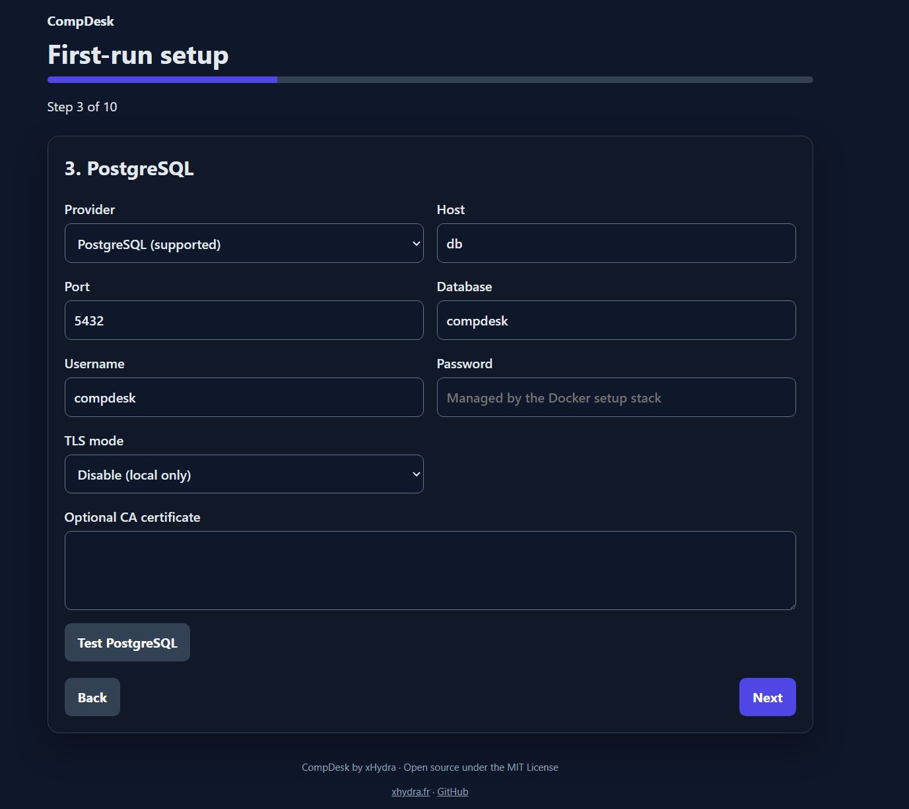
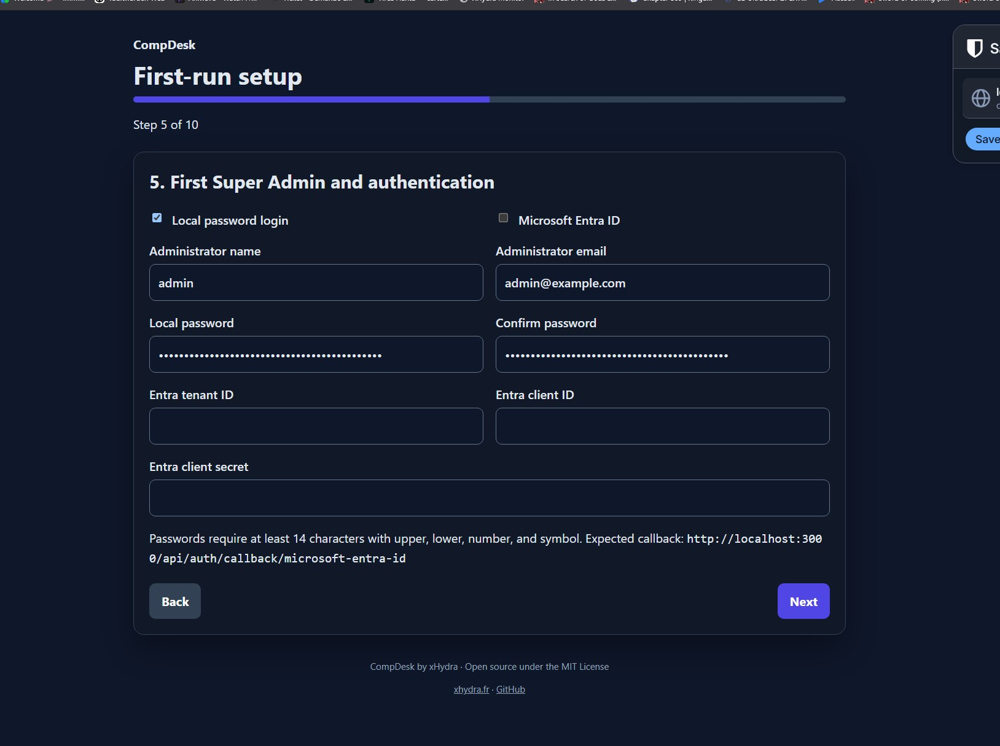
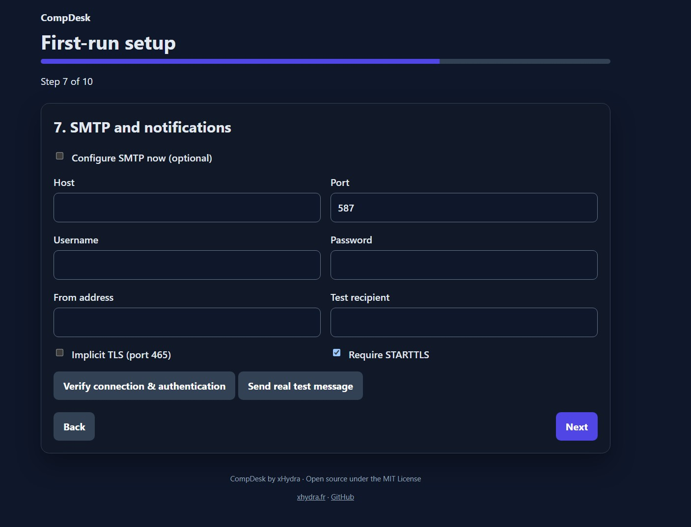
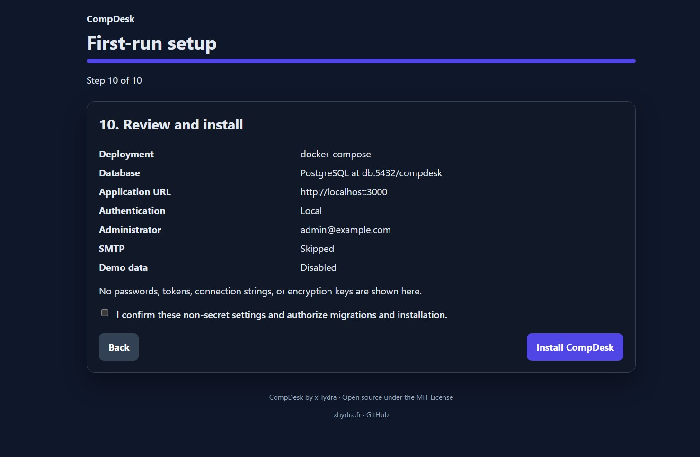

# First-run setup

CompDesk uses an isolated Node.js bootstrap server before the normal Next.js/Prisma runtime can start. PostgreSQL is the only supported production database.

## Standalone Node.js with existing PostgreSQL

1. Install Node.js 22.12 or later and run `npm ci` and `npm run build`.
2. Start `npm start`. When required runtime configuration or an installation record is absent, only the setup server and minimal health endpoints start.
3. On the same machine, open the localhost URL printed to the console and enter the separately printed one-time token. The token expires after 30 minutes.
4. Complete all ten steps. Normal application routes remain blocked until migrations, the first Super Admin, settings, and the installation record are committed.
5. Stop and restart `npm start`, then open the displayed sign-in URL.

Remote setup is disabled by default. If localhost access is impossible, expose setup only through a protected trusted network path, set `SETUP_ALLOW_REMOTE=true`, set `SETUP_PUBLIC_HOST` to the exact browser hostname, and retain token authentication. Never publish the setup listener directly to the Internet.

## Docker Compose first run

```bash
docker compose up -d
```

No `npm ci`, no host-side preparation step, and no second Compose command. A `config-init` service fixes volume ownership and generates a random database password into the `compdesk_config` volume without printing it, then the same `compdesk` container serves the wizard on `http://localhost:3000/setup` and automatically transitions itself to production once you finish — no `down`/`up` sequence, no rebuilt image, no manual restart. See [DEPLOY_DOCKER.md](DEPLOY_DOCKER.md) for the full walkthrough, upgrade, backup, and troubleshooting guidance.

Everything that used to live in `.compdesk/compdesk.env` (database URL, `AUTH_SECRET`, `APP_SETTINGS_ENCRYPTION_KEY`, and the rest) is written into the `compdesk_config` Docker volume instead of a host-mounted file; back it up the same way as the database (see [BACKUP_AND_RESTORE.md](BACKUP_AND_RESTORE.md)).

If the `compdesk_pgdata` volume already holds an initialized database but `compdesk_config` has no matching secrets (for example, `compdesk_config` was deleted independently), `config-init` refuses to mint a new random database password and exits with a recovery message instead of silently generating credentials PostgreSQL will not recognize. Restore `compdesk_config` from backup, import an existing installation with `node scripts/import-legacy-deployment.mjs`, or discard the existing database on purpose with `node scripts/docker-reset.mjs` before re-running `docker compose up -d`.

The previous two-stack flow (`docker-compose.setup.yml` + a separate production `docker-compose.yml`) is deprecated but still present for migration/rollback — see the "Migration from the two-stack deployment" section of [DEPLOY_DOCKER.md](DEPLOY_DOCKER.md).

## Wizard screenshots

A few of the ten steps, for reference:

| Step 3 — PostgreSQL | Step 5 — Administrator account |
| --- | --- |
|  |  |

| Step 7 — SMTP (optional) | Step 10 — Review and install |
| --- | --- |
|  |  |

## Security behavior

- Setup listens on loopback unless remote mode is explicitly enabled.
- A random bootstrap token is printed once, expires, is rate-limited, and authorizes only one active session.
- Mutations require an HttpOnly SameSite setup session, exact same origin, and a separate CSRF token.
- Resumable server state contains no database, administrator, SMTP, or Entra passwords.
- Secrets use atomic file replacement, restrictive permissions, and a backup of any existing configuration.
- Database checks distinguish DNS, TCP, TLS, authentication, missing database, and permission failures without returning a password or connection string.
- At least one login method is mandatory. Local passwords require 14 characters with upper/lowercase, number, and symbol.
- SMTP is optional. Verification and real-send are separate; relay acceptance is not proof of mailbox delivery.
- Storage setup records per-file, per-ticket, per-user temporary, expiry, and global quotas. ClamAV is optional; enabling it requires a reachable `clamd` host/port and scan errors then fail closed.
- Demo data is disabled by default. When enabled, credentials are random and shown once. `npm run demo:remove -- --confirm=REMOVE-DEMO-DATA` removes unreferenced demo accounts and deactivates referenced ones to preserve history.
- Successful installation creates an immutable database installation record. Revisiting setup returns 410 and deleting a browser cookie cannot recreate the Super Admin.

## Interrupted setup and local recovery

Non-secret choices are saved in `.compdesk/setup-state.json`. Restarting the setup server issues a new one-time token and resumes those choices. Passwords must be re-entered.

To archive an incomplete state and restart locally:

```bash
npm run setup:recover -- --confirm=RESET-INCOMPLETE-SETUP
```

This command refuses to reopen a completed installation and never deletes the database. Deleting the installation record is not a supported recovery procedure.

## Generated configuration

Standalone setup writes one ignored `.env`. Docker setup writes `.compdesk/compdesk.env`. Generated values include independent `AUTH_SECRET` and `APP_SETTINGS_ENCRYPTION_KEY` values of at least 32 random bytes. Keep the current and previous settings keys during documented rotation and back up them with the database.