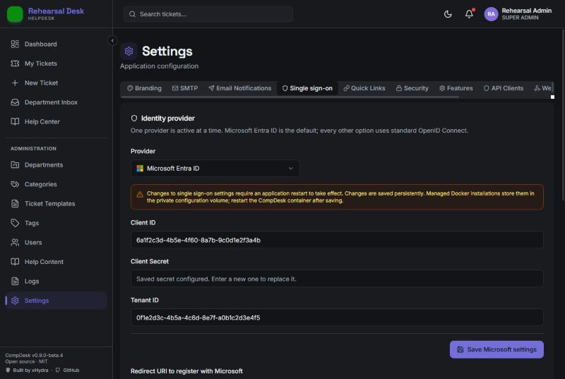
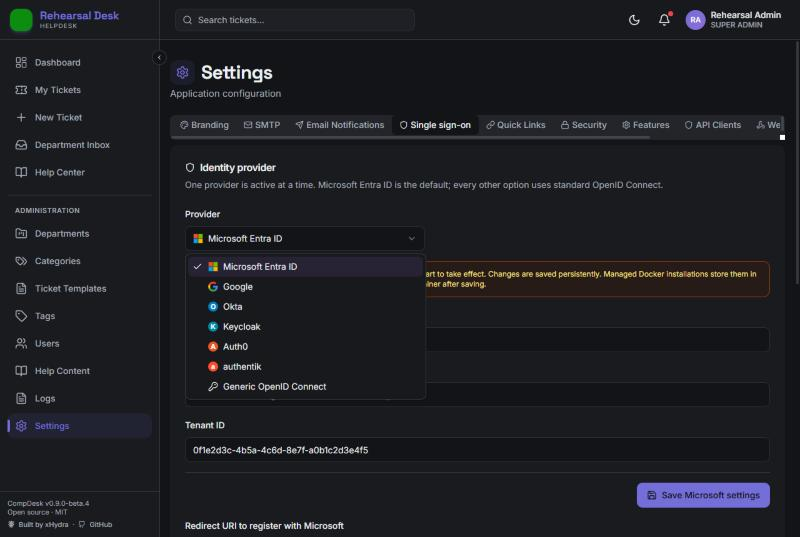
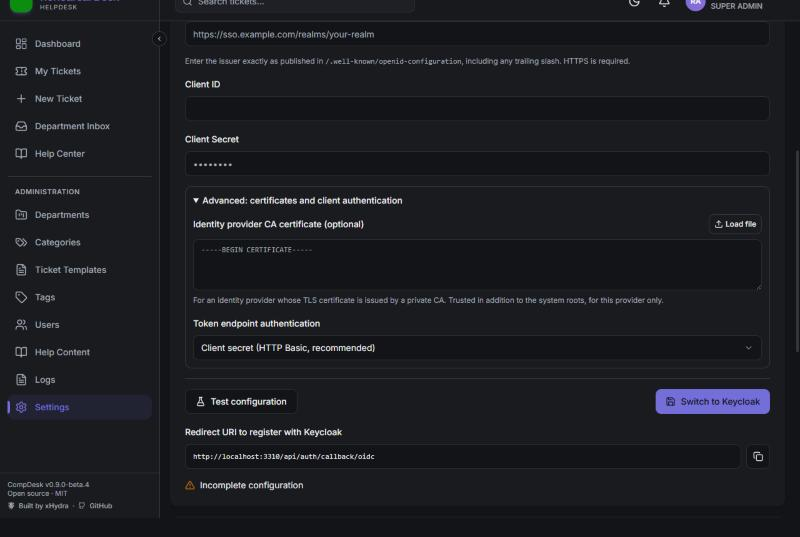
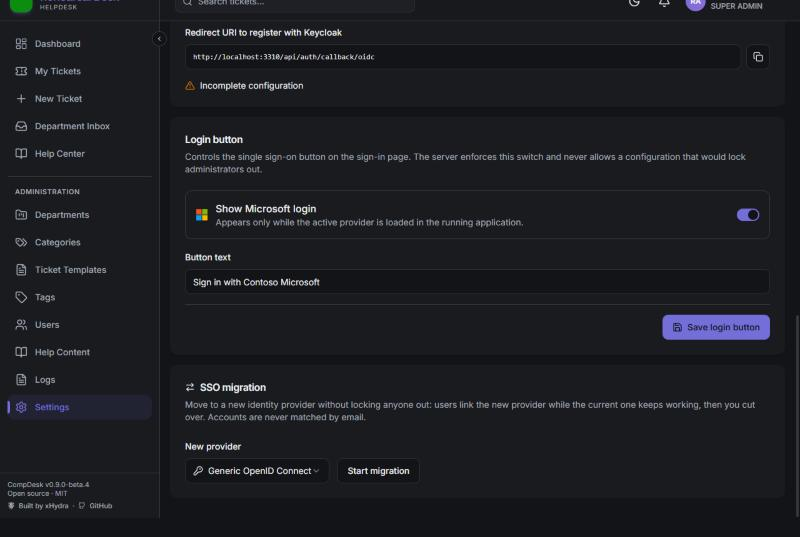
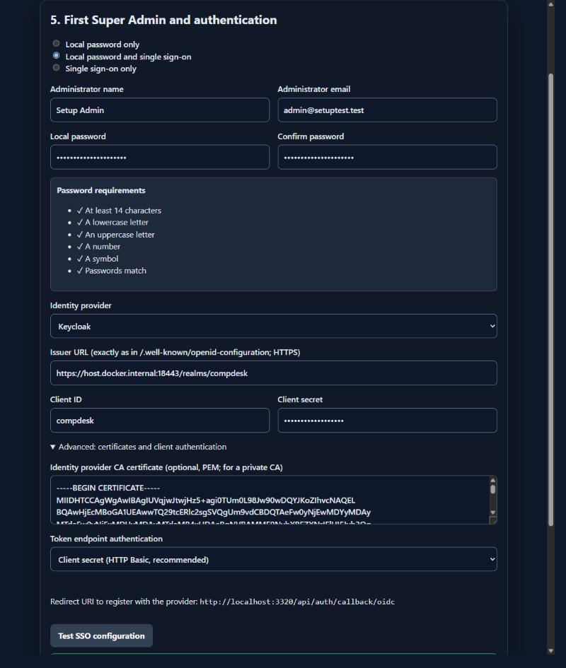
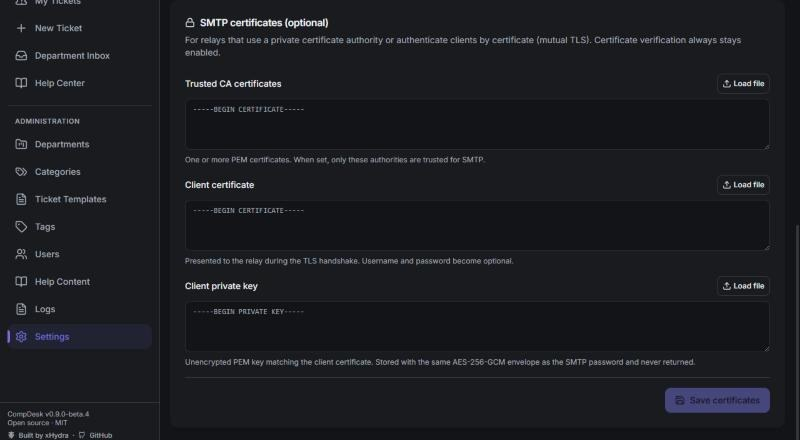

# Single sign-on

CompDesk supports one active single sign-on (SSO) provider at a time:

- **Microsoft Entra ID** (the default), or
- any standards-based **OpenID Connect** provider: Google, Okta, Keycloak, Auth0, authentik, or generic OIDC.

Local email and password login can run alongside SSO, or be turned off once SSO is proven to work for an administrator.

## Configure a provider

**Super Admin → Settings → Single sign-on → Identity provider**

1. Choose the provider. Presets only supply a label, a logo, and an issuer hint; all OpenID Connect options behave the same way.

   

2. Register CompDesk with the identity provider as a confidential web application.
   - Use the **Redirect URI** shown on the page: `AUTH_URL/api/auth/callback/oidc`, or `.../microsoft-entra-id` for Entra.
   - Request the `openid profile email` scopes.
3. Enter the **Issuer URL** exactly as the provider publishes it in `/.well-known/openid-configuration`, including any trailing slash. Then enter the **Client ID** and **Client Secret**.
4. Click **Test configuration**. It retrieves the discovery document and checks three things:
   - the issuer matches exactly,
   - every endpoint uses HTTPS,
   - the provider supports the selected client authentication method.

   No credentials are sent.
5. Save, then restart CompDesk. SSO credentials configure the authentication layer at process start.
6. Under **Login button**, enable the button and adjust its text if you want.

### Advanced: certificates and client authentication

**Identity provider CA certificate**

For an identity provider behind a private certificate authority, paste or load the CA certificate (PEM).

- CompDesk trusts it in addition to the system roots, for that provider only.
- No `NODE_EXTRA_CA_CERTS` or container changes are needed.

**`private_key_jwt`** (optional; client secret remains the default)

Instead of a secret, CompDesk signs a short-lived client assertion with a private key.

- **Key:** RSA 2048+, EC P-256 or EC P-384, unencrypted PEM.
- **Audience:** the issuer only (draft-ietf-oauth-rfc7523bis).
- **Lifetime and replay protection:** a 60-second lifetime and a unique `jti`.
- **Optional client certificate:** adds an `x5t#S256` thumbprint.
- **Key ID (`kid`):** leave it empty unless the provider requires one. Keycloak, for example, matches an uploaded certificate without a `kid`; if a `kid` is sent, it must be the provider's own key ID.

**Removing optional material**

Use the **Remove** buttons. An empty field never removes a saved value.

## Security rules

- **Identities are bound to `issuer + subject`.**
  - An email address never links or migrates an account, even when it matches.
  - Changing the active provider's issuer starts a new identity namespace; the Settings API warns how many links will stop matching.
- **Refused identities:** a provider that states `email_verified=false`, or an identity without an email claim.
- **Linking existing accounts:** a user signs in with their password, then uses **Profile → Link my … account**.
- **Request checks:** sign-in uses PKCE, `state`, and `nonce`.
- **Lockout protection is enforced everywhere:** Settings, branding, first-run setup, and every sign-in.
  - Local login can be disabled only while SSO is enabled, the selected provider is loaded, and at least one active Super Admin has linked it.
  - A configuration that would lock everyone out never takes effect: local login stays available and the event is audited.
- **Direct provider switching:** allowed only while local login is enabled and a Super Admin with a password exists. Existing links are kept. Use migration mode to move users without interruption.

## SSO migration mode

Use **SSO migration** to move from one identity provider to another, for example Keycloak → authentik or Entra → Okta.

1. **Start migration**, choose the new provider, enter its settings, test them, save, and restart CompDesk.
2. **Users link the new provider** from **Profile** while the current provider keeps working. The card shows linking progress and which Super Admins have linked.
3. **Cut over.** This is allowed only after the acting Super Admin has linked, and therefore authenticated with, the new provider. Cut-over only changes settings: no restart is needed and no account binding is rewritten.
4. **Rollback window.** Until you finish, the previous provider stays available on the sign-in page for accounts already linked to it, so late users can still sign in and link the new provider. **Roll back** returns to the previous provider in one step.
5. **Finish migration.** This ends the window and removes the previous provider's credentials (effective after a restart). Optionally, it also removes the old account links.

## First-run setup

The setup wizard offers three choices: local password only, local password and SSO, or SSO only. It includes the provider dropdown, provider fields, certificate options under **Advanced**, the redirect URI, and **Test SSO configuration**.

Setup refuses **SSO only**, because the first Super Admin cannot have a linked SSO identity yet. Instead:

1. Choose **local password and SSO**.
2. After signing in, link your account from Profile.
3. Disable local login in **Settings → Security**.

## SMTP certificates

**Settings → SMTP → SMTP certificates** supports relays that use a private CA, or that authenticate clients by certificate (mutual TLS).

- **CA bundle:** replaces the system trust store for SMTP only.
- **Client certificate and key:** make username and password optional. The key is stored encrypted and never returned.
- **Certificate verification** always stays enabled.
- **Removing:** use **Remove**. Removing either half of the client pair removes both.

See [Configuration](CONFIGURATION.md) for the equivalent environment variables.
